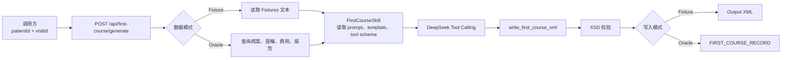

# HIS 数据首次病程填充 Demo

一个基于 ASP.NET Core 的首次病程录入服务 Demo。调用方只需提交患者 ID 与就诊 ID；服务从模拟 HIS 数据源读取病案、医嘱、费用和报告，调用 DeepSeek Tool Calling 生成首次病程 XML，经 XSD 校验后写入本地文件或 Oracle Demo 数据库。

> 本项目仅用于技术演示。病例、医院、人员和就诊标识均为脱敏样例；XML 契约、HIS 表结构与回写规则均不代表任何医院生产系统。

## 功能概览

- 唯一业务接口：`POST /api/first-course/generate`
- 固定输入：`patientId`、`visitId`
- 两种运行模式：
  - `Fixture`：从 `Fixtures/` 读取样例 HIS 文本，XML 写入 `Output/`
  - `Oracle`：从本地 Docker Oracle 读取 HIS 数据，XML 回写 `FIRST_COURSE_RECORD`
- 通过资源文件管理业务技能、提示词、XML 模板、XSD 与模型工具 JSON Schema
- 使用两轮 DeepSeek Tool Calling：模型请求工具 → C# 执行、校验与写入 → 模型确认完成
- 提供单元测试、Oracle 集成测试及真实 DeepSeek 联调测试

## 工作流程



模型不直接访问文件或数据库。模型只返回 `write_first_course_xml` 的 XML 参数；所有 XSD 校验和实际写入均由 C# 在模型调用之外执行。

## 环境要求

| 组件 | 必需场景 |
|---|---|
| .NET 8 SDK | 所有场景 |
| DeepSeek API Key | 生成 XML 的真实调用 |
| Docker Desktop | 使用本地 Oracle Demo 时 |
| Oracle Server / Oracle Client | 不需要；项目使用 `Oracle.ManagedDataAccess.Core` 托管驱动 |

## 快速开始：Fixture 模式

Fixture 是默认模式，适合快速验证 HTTP、技能资源、DeepSeek Tool Calling 和本地 XML 输出。

```powershell
git clone <你的仓库地址>
cd <仓库目录>

$env:DEEPSEEK_API_KEY = "你的 DeepSeek API Key"

dotnet run `
  --project .\src\HisMedicalRecordFillDemo\HisMedicalRecordFillDemo.csproj `
  --urls "http://127.0.0.1:5088"
```

服务启动后，在另一个终端调用：

```powershell
Invoke-RestMethod `
  -Method Post `
  -Uri "http://127.0.0.1:5088/api/first-course/generate" `
  -ContentType "application/json" `
  -Body '{"patientId":"CASE-001","visitId":"TEST20260811001"}'
```

成功响应示例：

```json
{
  "success": true,
  "outputPath": "F:\\...\\Output\\首次病程记录_CASE-001_...xml",
  "message": "工具已执行完成。"
}
```

Fixture 模式的 XML 会保存到项目根目录的 `Output/`。

## 使用本地 Oracle Demo

Oracle 模式用于演示完整链路：读取数据库中的 HIS 数据，并把生成的 XML 回写数据库。

### 1. 启动并初始化数据库

```powershell
docker compose -f .\docker-compose.oracle-demo.yml up -d

Get-Content -Raw .\oracle\init-demo.sql |
  docker exec -i his-oracle-demo sqlplus -s HIS_DEMO/HisDemo_2026@//localhost:1521/FREEPDB1
```

> `init-demo.sql` 会重建本地 Demo 表并清空其既有数据，仅可用于本地演示环境。

### 2. 以 Oracle 模式启动服务

```powershell
$env:DEEPSEEK_API_KEY = "你的 DeepSeek API Key"
$env:Database__Mode = "Oracle"
$env:Database__OracleConnectionString = "User Id=HIS_DEMO;Password=HisDemo_2026;Data Source=localhost:1521/FREEPDB1"

dotnet run `
  --project .\src\HisMedicalRecordFillDemo\HisMedicalRecordFillDemo.csproj `
  --urls "http://127.0.0.1:5088"
```

使用同一个 API 调用即可。成功时 `outputPath` 会是：

```text
oracle://FIRST_COURSE_RECORD/CASE-001/TEST20260811001
```

本地 Oracle Demo 预置两组脱敏数据：

| patientId | visitId |
|---|---|
| `CASE-001` | `TEST20260811001` |
| `CASE-002` | `TEST20260812002` |

## API 参考

### `POST /api/first-course/generate`

请求体：

```json
{
  "patientId": "CASE-001",
  "visitId": "TEST20260811001"
}
```

| 状态码 | 含义 |
|---|---|
| `200` | HIS 数据读取、XML 生成、XSD 校验和写入全部成功 |
| `400` | `patientId` 或 `visitId` 为空 |
| `404` | Fixture 或 Oracle 中不存在对应就诊数据 |
| `500` | DeepSeek 调用、工具调用、XML 校验或写入失败 |

## 配置

`src/HisMedicalRecordFillDemo/appsettings.json` 仅保存非敏感默认值。部署时优先通过环境变量覆盖配置。

| 环境变量 | 说明 | 默认值 |
|---|---|---|
| `DEEPSEEK_API_KEY` | DeepSeek API Key | 必填 |
| `DeepSeek__BaseUrl` | 模型 API 根地址 | `https://api.deepseek.com/beta` |
| `DeepSeek__Model` | 模型名称 | `deepseek-v4-flash` |
| `Database__Mode` | `Fixture` 或 `Oracle` | `Fixture` |
| `Database__OracleConnectionString` | Oracle 连接串 | 空 |

不要将真实 API Key、医院数据库地址或生产账号写入源码、`appsettings.json` 或文档。

## 资源与工具约定

```text
Resources/
├─ Skills/FirstCourse/
│  ├─ skill.json                  # 技能元数据、允许工具和必调工具
│  ├─ prompt.md                   # 提示词
│  ├─ template.xml                # XML 结构参考
│  └─ schema.xsd                  # 最终 XML 校验契约
└─ Tools/
   └─ write_first_course_xml.json # 给模型看的工具声明
```

工具分为两部分：

- `Resources/Tools/*.json`：模型可见的工具名称、说明和 JSON Schema。
- `src/HisMedicalRecordFillDemo/Tools/*.cs`：C# 侧的真实执行器，负责参数校验、XSD 校验和写入。

新增业务类型时，应新增独立的 Skill 资源目录、Skill 实现与所需工具执行器；通用的 `DeepSeekToolCallingClient` 不需要因为业务变化而修改。

## 项目结构

```text
.
├─ src/HisMedicalRecordFillDemo/  # ASP.NET Core 服务
│  ├─ Controllers/                # HTTP 接口
│  ├─ Services/                   # HIS 读取、模型调用、写入与 XML 校验
│  ├─ Skills/                     # 技能上下文组装
│  └─ Tools/                      # 工具注册与执行
├─ Resources/                     # 提示词、模板、XSD、工具 JSON Schema
├─ Fixtures/                      # Fixture 模式的脱敏 HIS 样例
├─ oracle/                        # Oracle Demo 初始化与单独数据种子脚本
├─ tests/                         # 单元与集成测试
└─ docs/                          # 使用说明、演示脚本与开发过程归档
```

## 测试

普通测试不调用真实 DeepSeek，也不消耗模型额度：

```powershell
dotnet test .\HisMedicalRecordFillDemo.sln
```

Oracle 集成测试：

```powershell
$env:RUN_ORACLE_INTEGRATION_TEST = "true"
dotnet test .\HisMedicalRecordFillDemo.sln --filter "Category=OracleIntegration"
```

真实 DeepSeek 联调（会消耗额度）：

```powershell
$env:DEEPSEEK_API_KEY = "你的 DeepSeek API Key"
$env:RUN_DEEPSEEK_INTEGRATION_TEST = "true"
dotnet test .\HisMedicalRecordFillDemo.sln --filter "Category=Integration"
```

## 文档

| 文档 | 用途 |
|---|---|
| [运行与测试](./docs/operations/服务部署与测试命令.md) | 本地运行、测试与发布命令 |
| [Oracle 本地 Demo](./docs/operations/Oracle本地Demo数据库.md) | Oracle Docker、连接信息与数据模型 |
| [演示脚本](./docs/demo/首次病程录入演示脚本.md) | 使用 Apifox 与 Navicat 的演示步骤 |
| [开发过程归档](./docs/development/) | 原始需求、阶段计划与设计决策 |

## 当前边界

- 只实现“首次病程”这一项业务技能。
- 本地 Oracle 仅是脱敏 Demo，不连接真实医院 HIS。
- 真实医院的 XML 字段标准、查询 SQL、回写存储过程和自部署模型协议仍需要由院方确认后替换。
- 项目聚焦核心流程，未实现鉴权、身份识别、队列、重试或缺失数据补全。
